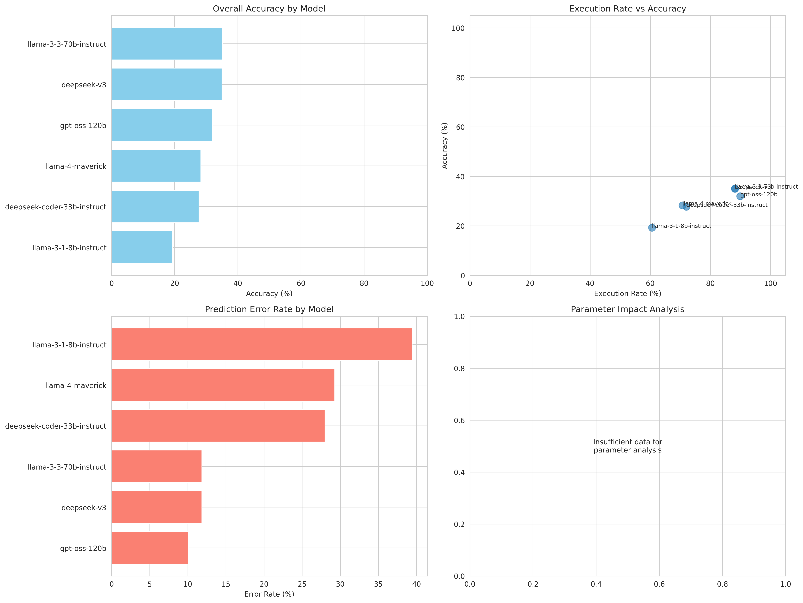
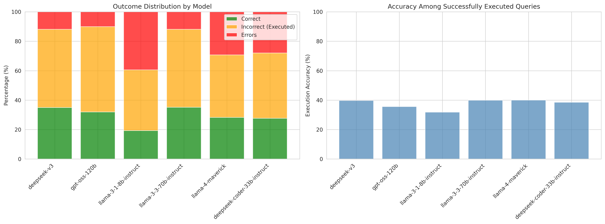

# Text-to-SQL Experimental Results Analysis

**Analysis Date:** 2025-11-06 09:13:22

**Dataset:** all_results.csv

---

## Executive Summary

- **Total Experiments:** 4,153
- **Unique Models Tested:** 6
- **Unique Questions:** 100
- **Overall Accuracy:** 29.54%
- **Execution Rate:** 78.11%
- **Prediction Error Rate:** 21.89%

## Key Findings

### Best Performing Model
- **Model:** llama-3-3-70b-instruct
- **Accuracy:** 35.14%

### Most Reliable Model (Highest Execution Rate)
- **Model:** gpt-oss-120b
- **Execution Rate:** 89.89%

## Detailed Model Performance

| Model | Total | Accuracy | Exec Rate | Error Rate |
|-------|-------|----------|-----------|------------|
| deepseek-v3 | 700 | 35.00% | 88.14% | 11.86% |
| gpt-oss-120b | 653 | 32.01% | 89.89% | 10.11% |
| llama-3-1-8b-instruct | 700 | 19.29% | 60.57% | 39.43% |
| llama-3-3-70b-instruct | 700 | 35.14% | 88.14% | 11.86% |
| llama-4-maverick | 700 | 28.29% | 70.71% | 29.29% |
| deepseek-coder-33b-instruct | 700 | 27.71% | 72.00% | 28.00% |

## Error Analysis

**Total Prediction Errors:** 909

### Top 5 Most Common Errors:

1. `Binder Error: at least one window function must appear in the SELECT column or QUALIFY clause` (13 occurrences)
2. `002140 (42601): SQL compilation error:
Unknown function DIVIDE` (6 occurrences)
3. `division by zero` (6 occurrences)
4. `incomplete input` (5 occurrences)
5. `Catalog Error: Table with name patient does not exist!
Did you mean "pg_settings"?

LINE 2: FROM patient T1 
             ^` (5 occurrences)

## Visualizations

## Recommendations

1. **Primary Model Choice:** Use llama-3-3-70b-instruct for highest accuracy (35.14%)
2. **Reliability:** gpt-oss-120b has the highest execution success rate (89.89%)

---

*Generated by analyze_results.py*