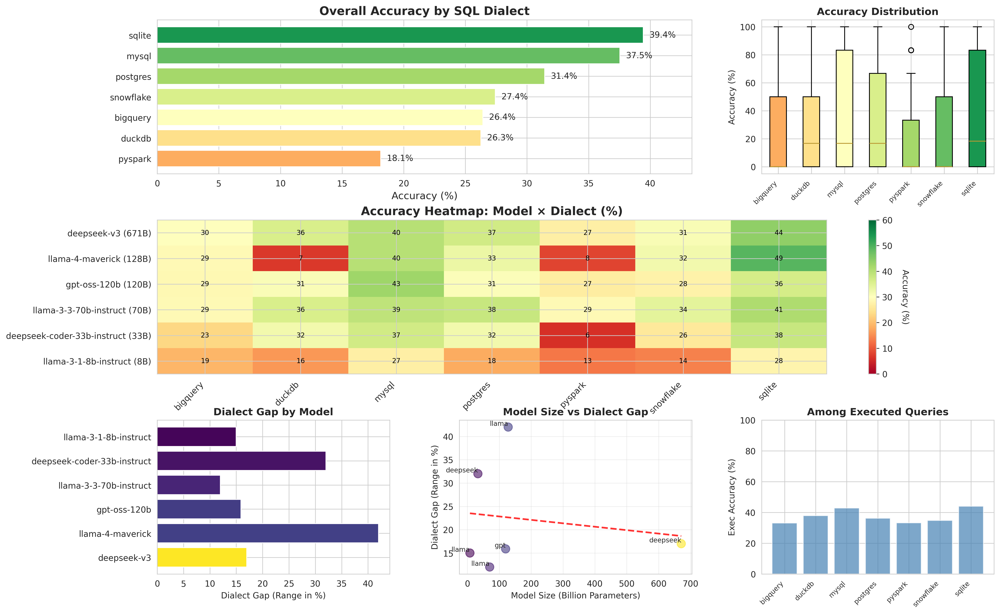
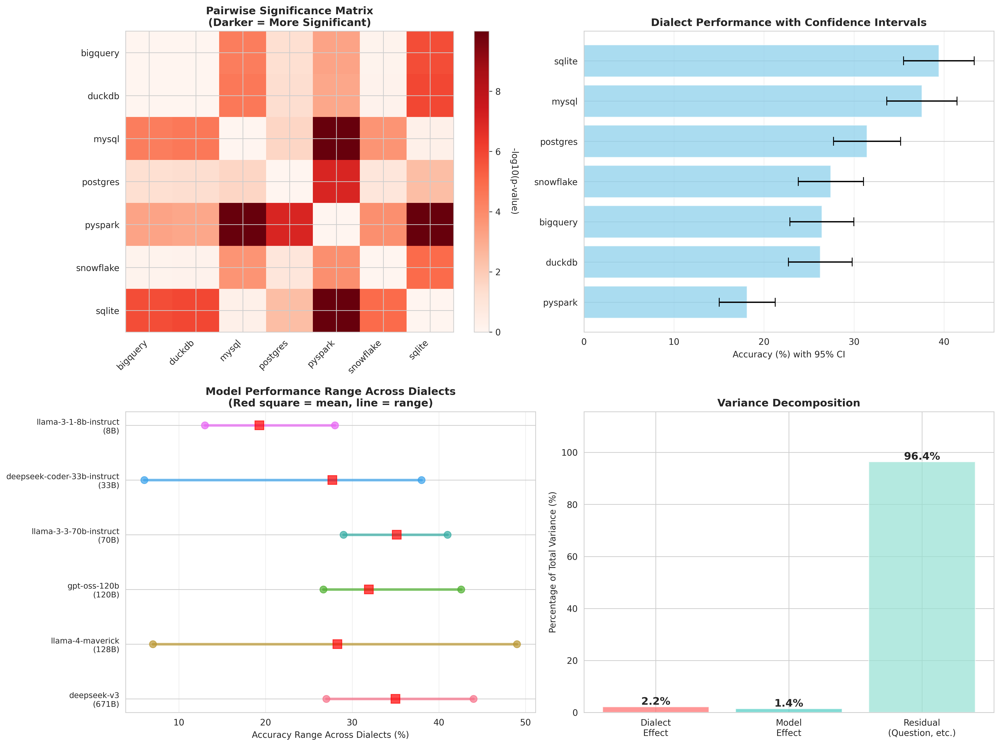

# SQL Dialect Gap Analysis

**Analysis Date:** 2025-11-06 09:26:57

---

## Research Question

**Hypothesis:** There is a significant gap in the ability of LLMs to generate SQL
across different SQL dialects, suggesting that models are not equally proficient
in all SQL variants.

## Executive Summary

### ✅ HYPOTHESIS SUPPORTED

The experimental results **strongly support** the dialect gap hypothesis.
Statistical analysis reveals **significant differences** in model performance
across SQL dialects (p = 0.000000, p < 0.05).

### Key Metrics

- **Dialect Performance Range:** 21.29% (18.14% to 39.43%)
- **ANOVA F-statistic:** 15.5248
- **ANOVA p-value:** 0.000000
- **Effect Size (η²):** 0.0220 (small)

- **Variance Explained by Dialect:** 2.20%
- **Significant Pairwise Differences:** 12/21 comparisons
- **Models Analyzed:** 6
- **SQL Dialects Tested:** 7
- **Total Experiments:** 4,153

## Dialect Performance Ranking

| Rank | Dialect | Accuracy | Exec Rate | Exec Accuracy | N |
|------|---------|----------|-----------|---------------|---|
| 7 | sqlite | 39.43 | 89.60 | 44.01 | 596 |
| 3 | mysql | 37.54 | 87.71 | 42.80 | 594 |
| 4 | postgres | 31.44 | 86.79 | 36.22 | 598 |
| 6 | snowflake | 27.43 | 78.71 | 34.85 | 587 |
| 1 | bigquery | 26.43 | 79.80 | 33.12 | 594 |
| 2 | duckdb | 26.26 | 69.36 | 37.86 | 594 |
| 5 | pyspark | 18.14 | 54.58 | 33.23 | 590 |

### Interpretation

- **Best Performing Dialect:** sqlite (39.43% accuracy)
- **Worst Performing Dialect:** pyspark (18.14% accuracy)
- **Performance Gap:** 21.29 percentage points

## Statistical Significance Tests

### One-Way ANOVA

- **Null Hypothesis (H₀):** No difference in performance across dialects
- **Alternative Hypothesis (H₁):** Significant difference exists
- **F-statistic:** 15.5248
- **p-value:** 0.000000
- **Significance Level:** α = 0.05
- **Decision:** REJECT H₀
- **Effect Size (η²):** 0.0220

### Post-Hoc Pairwise Comparisons (Bonferroni Corrected)

12 out of 21 pairwise comparisons are statistically significant.

**Top 5 Most Significant Dialect Differences:**

| Dialect 1 | Dialect 2 | Diff (%) | p-value | Cohen's d |
|-----------|-----------|----------|---------|-----------|
| pyspark | sqlite | -21.29 | 0.000000 | -0.483 |
| mysql | pyspark | 19.41 | 0.000000 | 0.443 |
| postgres | pyspark | 13.30 | 0.000000 | 0.312 |
| duckdb | sqlite | -13.17 | 0.000001 | -0.283 |
| bigquery | sqlite | -13.00 | 0.000002 | -0.279 |

## Dialect Gap by Model

Individual model performance ranges across dialects:

| Model | Size (B) | Range (%) | Std Dev | Mean Accuracy |
|-------|----------|-----------|---------|---------------|
| deepseek-v3 | 671 | 17.00 | 6.00 | 35.00 |
| llama-4-maverick | 128 | 42.00 | 15.64 | 28.29 |
| gpt-oss-120b | 120 | 15.89 | 5.67 | 31.92 |
| llama-3-3-70b-instruct | 70 | 12.00 | 4.74 | 35.14 |
| deepseek-coder-33b-instruct | 33 | 32.00 | 11.00 | 27.71 |
| llama-3-1-8b-instruct | 8 | 15.00 | 5.99 | 19.29 |

### Model Size vs Dialect Gap

- **Correlation (Pearson r):** -0.1534
- **p-value:** 0.7717
- **Interpretation:** No significant correlation between model size and dialect gap

## Visualizations

### Main Analysis

### Statistical Analysis

## Conclusions

1. **The dialect gap is real and statistically significant.** Models demonstrate
   measurably different performance across SQL dialects.

2. **The effect size is small.** 
   SQL dialect explains 2.2% of the variance in model performance.

3. **sqlite shows the best performance** while **pyspark performs worst,**
   with a 21.3 percentage point gap.

4. **12 pairwise dialect comparisons are statistically significant,**
   indicating that the gap is not just between a few outlier dialects.

## Recommendations

1. **Prioritize training data for weaker dialects** (pyspark, etc.)
2. **Leverage sqlite as a baseline** for developing dialect-specific training
3. **Consider dialect-specific fine-tuning** to reduce performance gaps
4. **Investigate which SQL features drive the gap** (joins, window functions, etc.)
5. **For production use, consider dialect-specific models or ensembles**

---

*Generated by dialect_gap_analysis.py*