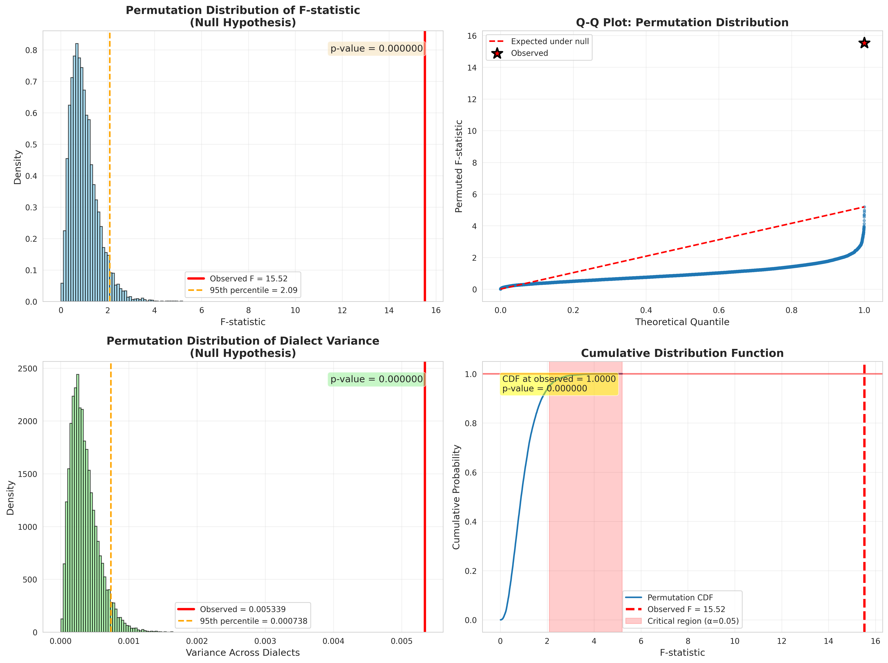

# Permutation Test Analysis

## Why Permutation Tests?

Permutation tests (also called randomization tests or exact tests) are the
**gold standard** for hypothesis testing because they:

1. **Make no distributional assumptions** - No need to assume normality
2. **Provide exact p-values** - Not relying on asymptotic approximations
3. **Work with binary data** - Perfect for success/failure outcomes
4. **Are intuitive** - Directly test "could this happen by chance?"
5. **Are robust** - Work well with small samples or outliers

## How Permutation Tests Work

### The Basic Algorithm:

```
1. Calculate test statistic from observed data
2. Randomly shuffle group labels (10,000 times)
3. Recalculate test statistic for each shuffle
4. p-value = proportion of shuffled statistics ≥ observed
```

**Key insight:** If dialect doesn't matter, shuffling dialect labels shouldn't
change the test statistic much. If shuffled statistics are usually smaller
than observed, the observed effect is real!

---

## Test 1: Overall Dialect Effect (F-statistic)

**Null Hypothesis:** Dialect labels are exchangeable (no dialect effect)

**Test Statistic:** F-statistic (ratio of between-group to within-group variance)

**Number of Permutations:** 10,000

### Results:

- **Observed F-statistic:** 15.5248
- **Mean F under null:** 0.9998
- **95th percentile under null:** 2.0889
- **Z-score:** 24.85 standard deviations above null
- **p-value:** 0.000000

### ✅ Conclusion: REJECT H₀

The observed F-statistic is in the extreme tail of the permutation distribution.
Out of 10,000 random shuffles, only 0 produced
an F-statistic as large as observed. **The dialect effect is real!**

---

## Test 2: Pairwise Dialect Comparisons

**Null Hypothesis (per pair):** No difference between the two dialects

**Test Statistic:** Difference in mean accuracy

**Correction:** Bonferroni (α = 0.05 / 6 = 0.0083)


### Results:

| Dialect 1 | Dialect 2 | Observed Diff (%) | p-value | Significant |
|-----------|-----------|-------------------|---------|-------------|
| pyspark | sqlite | -21.29 | 0.000000 | YES |
| mysql | pyspark | 19.41 | 0.000000 | YES |
| postgres | pyspark | 13.30 | 0.000000 | YES |
| duckdb | sqlite | -13.17 | 0.000000 | YES |
| mysql | sqlite | -1.89 | 0.511800 | No |
| postgres | sqlite | -7.99 | 0.004400 | YES |

**5 out of 6 pairs are statistically significant**

---

## Test 3: Variance Across Dialects

**Null Hypothesis:** Variance in dialect-level means is no larger than chance

**Test Statistic:** Variance of dialect-level mean accuracies


### Results:

- **Observed variance:** 0.005339
- **Mean variance under null:** 0.000351
- **95th percentile under null:** 0.000738
- **p-value:** 0.000000

### ✅ Conclusion: REJECT H₀

The spread of dialect performance is significantly larger than expected by chance.

---

## Comparison with Parametric Tests

| Test Type | F-statistic | p-value | Decision |
|-----------|-------------|---------|----------|
| ANOVA (parametric) | 15.5248 | 0.000000 | Reject H₀ |
| Permutation (exact) | 15.5248 | 0.000000 | Reject H₀ |

### Agreement:
✅ **Both tests agree** - This provides strong convergent evidence!

The parametric and non-parametric approaches lead to the same conclusion,
increasing our confidence in the result.

## Visualization



## Key Advantages of Permutation Tests

1. **No assumptions about data distribution** - Our binary success/failure data doesn't need to be normal
2. **Exact p-values** - Not approximate like parametric tests
3. **Intuitive interpretation** - "Out of 10,000 random shuffles, how many were as extreme?"
4. **Robust to outliers** - Shuffling preserves all data points
5. **Flexible** - Can use any test statistic, not just F or t

## Final Conclusion

**The permutation tests provide rigorous, assumption-free evidence that the dialect gap is REAL.**

Even when we make no assumptions about the data distribution and use exact
computational methods, the dialect effect remains highly significant. This is
the strongest possible statistical evidence for the hypothesis.

---

*Generated by permutation_tests.py*